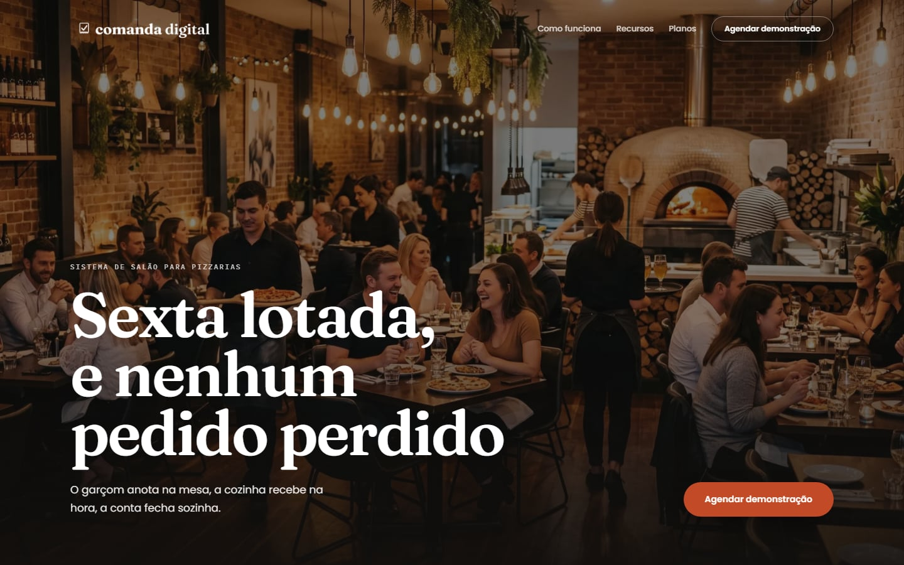

<div align="center">

# Comanda Digital

**Sexta lotada, e nenhum pedido perdido.**<br>
Site de divulgação do Comanda Digital, o sistema de salão para pizzarias: o garçom anota na mesa, a cozinha recebe na hora e a conta fecha sozinha.

<br>


<br>



<br><br>


&nbsp;&nbsp;&nbsp;


</div>

---

## Sobre

Landing page de uma única página, pensada para donos de pizzarias e restaurantes pequenos. Implementação em código do design criado no Claude Design (v4): hero com foto do salão, painel do balcão, passos de funcionamento, recursos, planos, FAQ e formulário de demonstração.

O sistema em si (app do garçom, cozinha e caixa) **não faz parte deste repositório**. Aqui vive só o site que o divulga.

## Destaques

- **Design fiel ao protótipo**: tipografia editorial (Fraunces + Poppins + IBM Plex Mono), paleta terracota/grafite/creme e layout responsivo até o celular.
- **Animações com propósito**: identidade de movimento definida em tokens (120 / 280 / 560 ms), progresso dos "três passos" acompanhando o scroll, menu que vira X, e respeito total a `prefers-reduced-motion`.
- **SEO técnico pronto**: Open Graph e Twitter Card, canonical, `robots.txt` e `sitemap.xml` gerados pelo Next, e JSON-LD (`Organization`, `SoftwareApplication` e `FAQPage`).
- **Indexação controlada por ambiente**: previews e staging nunca entram no Google por acidente (veja [SEO e indexação](#seo-e-indexação)).
- **Banner de cookies (LGPD)**: Aceitar e Rejeitar com o mesmo peso visual, escolha persistida no navegador e sem deslocamento de layout (CLS 0).
- **Performance**: fontes self-hosted via `next/font`, imagens servidas por `next/image` e foto do hero comprimida de 3,8 MB para ~550 KB.

## Stack

| Camada | Tecnologia |
| --- | --- |
| Framework | Next.js 16 (App Router, Turbopack) |
| UI | React 19 + TypeScript 5.9 |
| Estilo | CSS Modules + variáveis CSS (sem biblioteca de UI) |
| Fontes | `next/font/google`: Fraunces, Poppins, IBM Plex Mono |
| Imagens | `next/image` |
| Qualidade | ESLint 9 (`eslint-config-next`) |

## Começando

**Requisitos:** Node.js 20.9 ou superior.

```bash
git clone https://github.com/juliobraidou/comanda-digital-site.git
cd comanda-digital-site

npm install
cp .env.example .env.local   # ajuste as variáveis, se quiser
npm run dev
```

Abra [http://localhost:3000](http://localhost:3000).

### Scripts

| Comando | O que faz |
| --- | --- |
| `npm run dev` | Servidor de desenvolvimento |
| `npm run build` | Build de produção |
| `npm run start` | Serve o build de produção |
| `npm run lint` | Roda o ESLint |

### Variáveis de ambiente

| Variável | Padrão | Descrição |
| --- | --- | --- |
| `NEXT_PUBLIC_SITE_URL` | `http://localhost:3000` | URL pública. Alimenta `metadataBase`, Open Graph, canonical, sitemap e JSON-LD. |
| `NEXT_PUBLIC_ALLOW_INDEXING` | _(ausente = bloqueado)_ | Só `"true"` libera os buscadores. |

> `NEXT_PUBLIC_*` são embutidas **no build**. Ao mudar qualquer uma delas, faça um novo deploy.

## SEO e indexação

Por padrão o site responde `noindex, nofollow` e o `robots.txt` retorna `Disallow: /`. É de propósito: um deploy de preview não deve aparecer no Google.

Para **publicar de verdade**, configure no ambiente de produção:

```env
NEXT_PUBLIC_SITE_URL=https://seu-dominio.com.br
NEXT_PUBLIC_ALLOW_INDEXING=true
```

Com isso as tags passam para `index, follow`, o `robots.txt` libera o site e aponta para o `sitemap.xml`, e todas as URLs absolutas usam o domínio real. Depois do lançamento, envie o sitemap no Google Search Console e rode o PageSpeed Insights na URL final.

## Estrutura

```text
.
├── docs/                    # prints usados neste README
├── public/images/           # hero, og-image, logo e mockups (já otimizados)
├── assets/                  # imagens originais (fonte)
├── src/
│   ├── app/
│   │   ├── layout.tsx       # fontes, metadata, banner de cookies
│   │   ├── page.tsx         # monta as seções
│   │   ├── globals.css      # tokens de cor, tipografia e movimento
│   │   ├── robots.ts
│   │   └── sitemap.ts
│   ├── components/site/     # uma seção por componente, cada uma com seu CSS Module
│   ├── data/faq.ts          # FAQ: fonte única do componente e do JSON-LD
│   └── lib/site.ts          # URL, nome, descrição e flag de indexação
├── .env.example
└── skills-lock.json         # origem e hash das skills de IA usadas no projeto
```

## Design tokens

| Token | Valor | Uso |
| --- | --- | --- |
| Terracota | `#C24A26` | Ações e destaques |
| Terracota escuro | `#9C3A1C` | Hover e rótulos sobre fundo claro |
| Grafite | `#2A211B` | Fundos escuros e texto principal |
| Creme | `#FAF6EF` | Fundo da página |
| Creme escuro | `#F2EFE7` | Campos e seções alternadas |
| Texto neutro | `#5A4E45` | Corpo de texto |

**Movimento:** `--dur-quick` 120 ms (hover e feedback), `--dur-standard` 280 ms (menus e cards), `--dur-slow` 560 ms (entradas de seção). Entradas desaceleram, saídas aceleram, sem overshoot.

## Skills de IA

O projeto foi refinado com duas skills do Claude Code. As pastas instaladas não vão para o Git (contêm symlinks com caminho da máquina e conteúdo de terceiros); o `skills-lock.json` registra a origem de cada uma. Para reinstalar:

```bash
npx skills add https://github.com/coreyhaines31/marketingskills --skill seo-audit
npx skills add https://github.com/lottiefiles/motion-design-skill --skill motion-design
```

## Pendências antes do lançamento

- [ ] **Formulário de demonstração**: o front-end está pronto, mas o envio ainda é simulado. Falta conectar a um endpoint (API route, e-mail, CRM ou WhatsApp).
- [ ] **Política de privacidade e termos**: os links do rodapé e do banner de cookies apontam para `#`. A política precisa existir de fato.
- [ ] **Redes sociais**: Instagram e WhatsApp no rodapé também são placeholders.
- [ ] **Favicon**: ainda é o ícone padrão do Next.js.
- [ ] **Logo do JSON-LD**: usa o PNG branco; o ideal é uma versão com fundo neutro.
- [ ] **Analytics**: a escolha de cookies já é gravada, mas ainda não condiciona nenhum script.

## Deploy

O caminho mais simples é a [Vercel](https://vercel.com): importe o repositório, defina as duas variáveis de ambiente acima e faça o deploy. Como o site é estático, qualquer hospedagem compatível com Next.js serve.

---

<div align="center">

Feito por [Julio Braido](https://github.com/juliobraidou)

</div>
